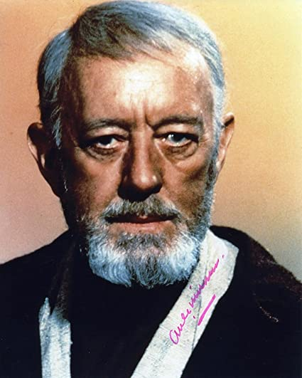

```{r, echo=FALSE, out.width="20%"}

```

***

# Education

*Year* | *Position*
------ | -------------
**40 BBY** | Padawan apprenticeship with Jedi Master Qui-Gon Jinn
**54 BBY** | Began training at the Jedi Temple, Coruscant

***

# Employment

- **0 BBY**: Rebel Alliance
- **19 BBY**: Custodian of Luke Skywalker, Tatooine, Arkanis, Outer Rim
- **22 BBY**: General, Republic Military, Clone Wars^[7^th^ Sky Corps and 501^st^ Legion]
- **32 BBY**: Jedi Knight, Invasion of Naboo, Chommell, Mid Rim

***

# Quotes

> Luke, you’re going to find that many of the truths we cling to depend greatly on our own point of view.
> The truth is often what we make of it; you heard what you wanted to hear, believed what you wanted to believe.

> Only a Sith deals in absolutes.

